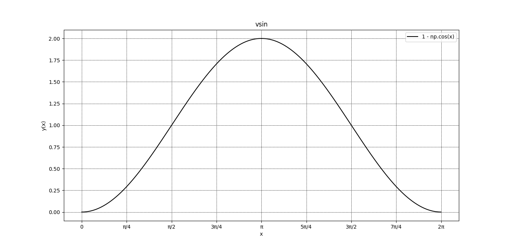
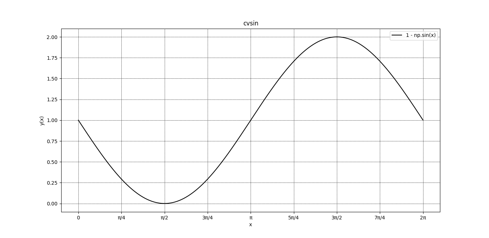
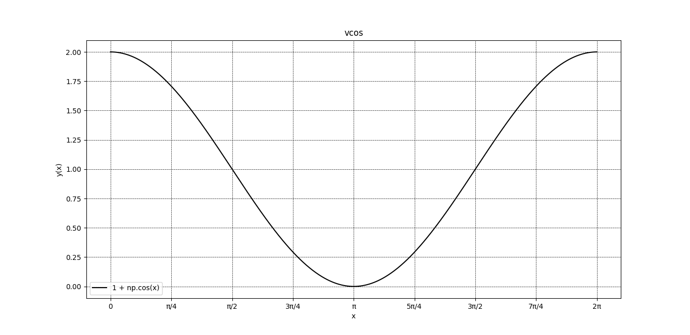
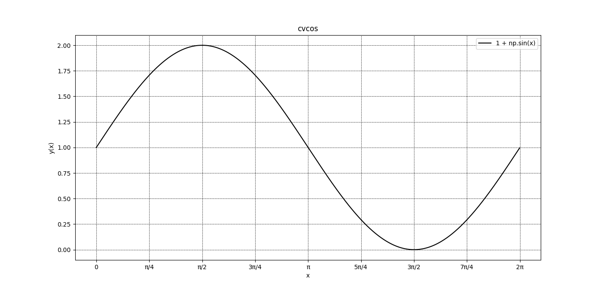
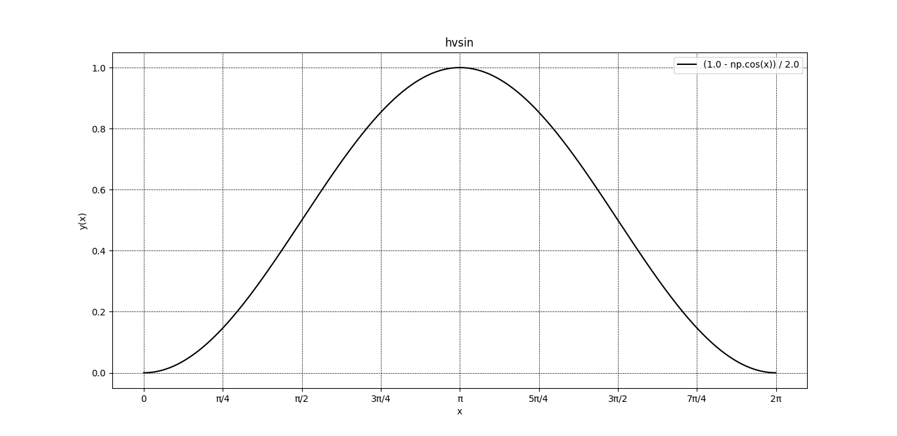
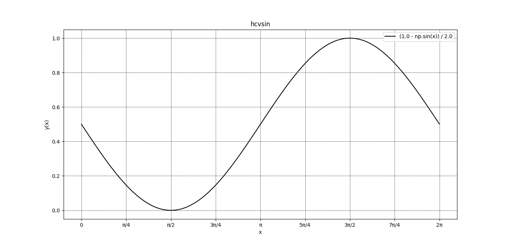
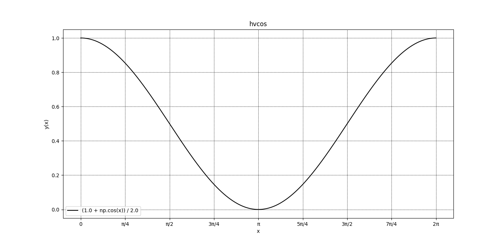
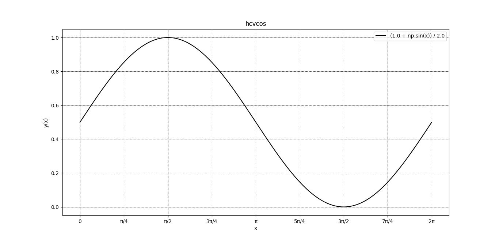

# mathplus - extended math libary

## Composite functions taking one value and returning one value

```txt
y(x) = f(g(x))
```

```rust
let f: impl Fn(f32) -> f32 = move |x: f32| 2.0 * x + 4.0;
let g: impl Fn(f32) -> f32 = move |x: f32| x * x;

let y: impl Fn(f32) -> f32 = mathplus::composite::function(f, g);

for x in 0..=10 {
    println!("x = {}; y(x) = {}", x, y(x as f32));
    // x = 0.0   y(x) = 4.0
    // x = 1.0   y(x) = 6.0
    // x = 2.0   y(x) = 12.0
    // x = 3.0   y(x) = 22.0
    // x = 4.0   y(x) = 36.0
    // x = 5.0   y(x) = 54.0
    // x = 6.0   y(x) = 76.0
    // x = 7.0   y(x) = 102.0
    // x = 8.0   y(x) = 132.0
    // x = 9.0   y(x) = 166.0
    // x = 10.0  y(x) = 204.0
}
```

## Hidden Trigonometry functions

The versine or versed sine is a trigonometric function found in some of the  earliest (Vedic Aryabhatia I) trigonometric tables.  
The versine of an angle is 1 minus its cosine.  
There are several related functions, most notably the coversine and haversine.  
The latter, half a versine, is of particular importance in
the haversine formula of navigation  
(source: Wikipedia)

### vsin(Θ) = 1 - cos(Θ)



### cvsin(Θ) = 1 - sin(Θ)



### vcos(Θ) = 1 + cos(Θ)



### cvcos(Θ) = 1 + sin(Θ)



### hvsin(Θ) = (1 - cos(Θ)) / 2



### hcvsin(Θ) = (1 - sin(Θ)) / 2



### hvcos(Θ) = (1 + cos(Θ)) / 2



### hcvcos(Θ) = (1 + sin(Θ)) / 2

